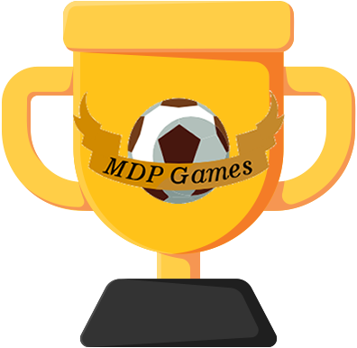
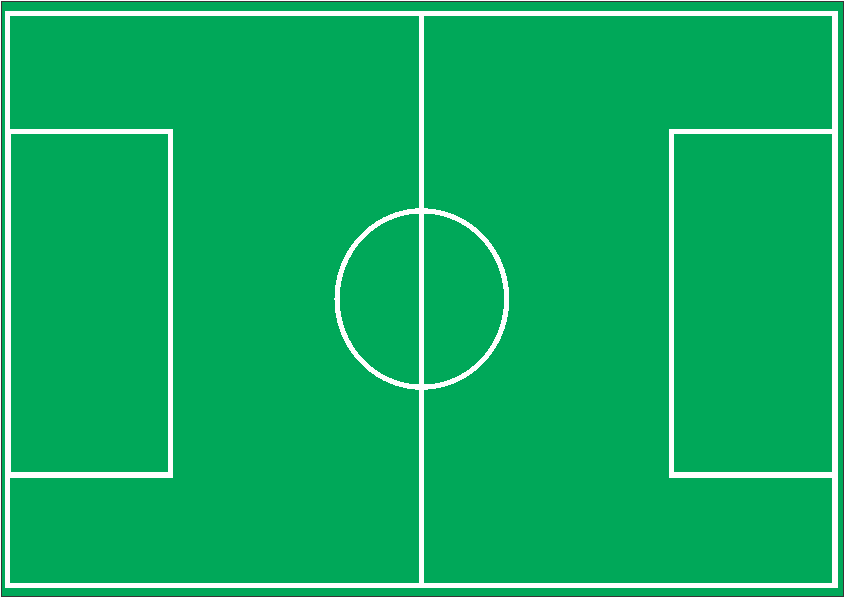
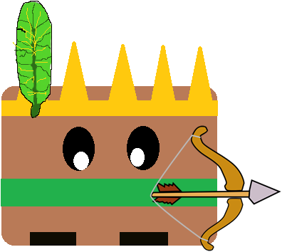
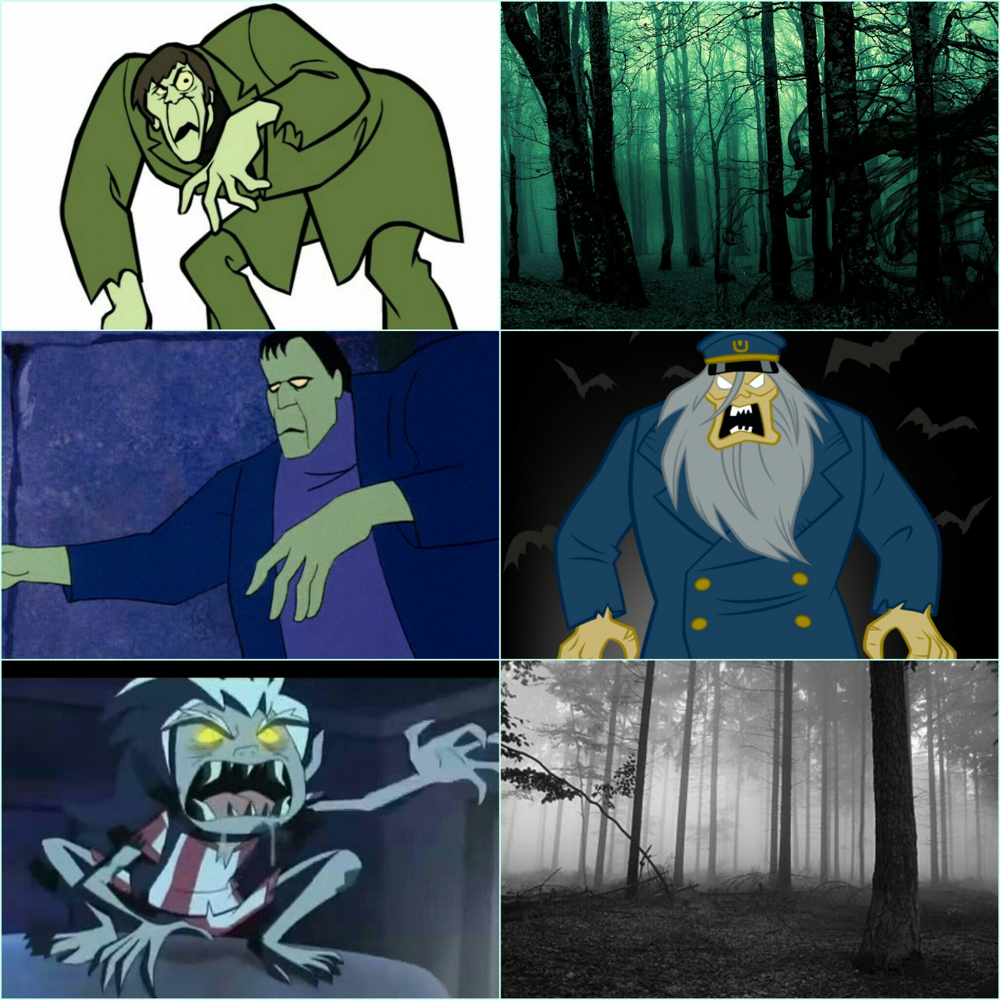

* * *

# QUEM SOU EU?  
#   
Vitor Manoel, estudante quase concluinte do curso de Programação de Jogos Digitais pelo IFRN-CM, 17 anos e futuro engenheiro químico.
Natal/RN

 * * *
# PORTIFÓLIO  
 * * *  
## JOGOS:  
[JOGO OFICINA 1 BIMESTRE: A caça ao mito ](https://alvaromd2016.github.io/A%20ca%C3%A7a%20ao%20mito/)  
[JOGO OFICINA 2 BIMESTRE: A História do Futebol ](https://vitor04.github.io/HistoryofSoccer/)   
[JOGO OFICINA 3 BIMESTRE: PUM ](https://elielton90.github.io/PUM/)  
[JOGO MOTORES 3 BIMESTRE: TOWER DEFENSE ](https://alvaromd2016.github.io/Tower%20Defense/)
 * * *  
## ARTES AUTORAIS:  
  

 * * *
 ## INFLUENCE MAP: 
 
 
 
 * * *  
## PARTICIPAÇÕES EM EVENTOS:    
 * AULA DE MÚSICA: **CIA MUSICAL TIÊ, OS SALTIMBANCOS, 2016.2**
 * AULA DE TEATRO: **CIA MUSICAL TIÊ, OS SALTIMBANCOS, 2016.2**
 * AULA DE JOGOS: **IFRN, PROGRAMAÇÃO DE JOGOS DIGITAIS, CRIANDO JOGOS DESDE 2017.1**
 
 1. Marcelo Barbosa, PROFESSOR DE MOTORES DE JOGOS E OFICINA DE CRIAÇÃO.
 2. Tiago Fernando, PROFESSOR DE GAME DESIGN.
 3. Durval Pacheco, PROFESSOR DE MULTIMÍDIA E ANIMAÇÃO.
 * * *
 
 ## Endereço para contato
 
  * E-MAIL: vitoralif@yahoo.com.br / vitinhomsf01@gmail.com
  * Facebook: Vitinho Silva
 
 

